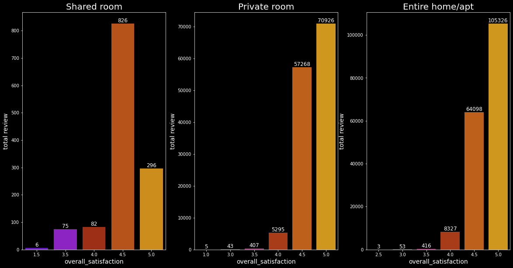

# Airbnb Data Analysis


```python

```

## Import package


```python
import pandas as pd
import numpy as np
import matplotlib.pyplot as plt
import seaborn as sns
pd.options.display.max_columns = 50
plt.style.use('dark_background')
```

## Load dataset and data review


```python
df = pd.read_csv('C:/Users/fikri/Desktop/pyproj/airbnb/df.csv')
df.head()
```


<div>
<style scoped>
    .dataframe tbody tr th:only-of-type {
        vertical-align: middle;
    }

    .dataframe tbody tr th {
        vertical-align: top;
    }

    .dataframe thead th {
        text-align: right;
    }
</style>
<table border="1" class="dataframe">
  <thead>
    <tr style="text-align: right;">
      <th></th>
      <th>room_id</th>
      <th>survey_id</th>
      <th>host_id</th>
      <th>room_type</th>
      <th>country</th>
      <th>city</th>
      <th>borough</th>
      <th>neighborhood</th>
      <th>reviews</th>
      <th>overall_satisfaction</th>
      <th>accommodates</th>
      <th>bedrooms</th>
      <th>bathrooms</th>
      <th>price</th>
      <th>minstay</th>
      <th>name</th>
      <th>last_modified</th>
      <th>latitude</th>
      <th>longitude</th>
      <th>location</th>
    </tr>
  </thead>
  <tbody>
    <tr>
      <th>0</th>
      <td>10176931</td>
      <td>1476</td>
      <td>49180562</td>
      <td>Shared room</td>
      <td>NaN</td>
      <td>Amsterdam</td>
      <td>NaN</td>
      <td>De Pijp / Rivierenbuurt</td>
      <td>7</td>
      <td>4.5</td>
      <td>2</td>
      <td>1.0</td>
      <td>NaN</td>
      <td>156.0</td>
      <td>NaN</td>
      <td>Red Light/ Canal view apartment (Shared)</td>
      <td>2017-07-23 13:06:27.391699</td>
      <td>52.356209</td>
      <td>4.887491</td>
      <td>0101000020E610000033FAD170CA8C13403BC5AA41982D...</td>
    </tr>
    <tr>
      <th>1</th>
      <td>8935871</td>
      <td>1476</td>
      <td>46718394</td>
      <td>Shared room</td>
      <td>NaN</td>
      <td>Amsterdam</td>
      <td>NaN</td>
      <td>Centrum West</td>
      <td>45</td>
      <td>4.5</td>
      <td>4</td>
      <td>1.0</td>
      <td>NaN</td>
      <td>126.0</td>
      <td>NaN</td>
      <td>Sunny and Cozy Living room in quite neighbours</td>
      <td>2017-07-23 13:06:23.607187</td>
      <td>52.378518</td>
      <td>4.896120</td>
      <td>0101000020E6100000842A357BA095134042791F477330...</td>
    </tr>
    <tr>
      <th>2</th>
      <td>14011697</td>
      <td>1476</td>
      <td>10346595</td>
      <td>Shared room</td>
      <td>NaN</td>
      <td>Amsterdam</td>
      <td>NaN</td>
      <td>Watergraafsmeer</td>
      <td>1</td>
      <td>0.0</td>
      <td>3</td>
      <td>1.0</td>
      <td>NaN</td>
      <td>132.0</td>
      <td>NaN</td>
      <td>Amsterdam</td>
      <td>2017-07-23 13:06:23.603546</td>
      <td>52.338811</td>
      <td>4.943592</td>
      <td>0101000020E6100000A51133FB3CC613403543AA285E2B...</td>
    </tr>
    <tr>
      <th>3</th>
      <td>6137978</td>
      <td>1476</td>
      <td>8685430</td>
      <td>Shared room</td>
      <td>NaN</td>
      <td>Amsterdam</td>
      <td>NaN</td>
      <td>Centrum West</td>
      <td>7</td>
      <td>5.0</td>
      <td>4</td>
      <td>1.0</td>
      <td>NaN</td>
      <td>121.0</td>
      <td>NaN</td>
      <td>Canal boat RIDE in Amsterdam</td>
      <td>2017-07-23 13:06:22.689787</td>
      <td>52.376319</td>
      <td>4.890028</td>
      <td>0101000020E6100000DF180280638F134085EE92382B30...</td>
    </tr>
    <tr>
      <th>4</th>
      <td>18630616</td>
      <td>1476</td>
      <td>70191803</td>
      <td>Shared room</td>
      <td>NaN</td>
      <td>Amsterdam</td>
      <td>NaN</td>
      <td>De Baarsjes / Oud West</td>
      <td>1</td>
      <td>0.0</td>
      <td>2</td>
      <td>1.0</td>
      <td>NaN</td>
      <td>93.0</td>
      <td>NaN</td>
      <td>One room for rent in a three room appartment</td>
      <td>2017-07-23 13:06:19.681469</td>
      <td>52.370384</td>
      <td>4.852873</td>
      <td>0101000020E6100000CD902A8A57691340187B2FBE682F...</td>
    </tr>
    <tr>
      <th>...</th>
      <td>...</td>
      <td>...</td>
      <td>...</td>
      <td>...</td>
      <td>...</td>
      <td>...</td>
      <td>...</td>
      <td>...</td>
      <td>...</td>
      <td>...</td>
      <td>...</td>
      <td>...</td>
      <td>...</td>
      <td>...</td>
      <td>...</td>
      <td>...</td>
      <td>...</td>
      <td>...</td>
      <td>...</td>
      <td>...</td>
    </tr>
    <tr>
      <th>18718</th>
      <td>17789893</td>
      <td>1476</td>
      <td>47501089</td>
      <td>Private room</td>
      <td>NaN</td>
      <td>Amsterdam</td>
      <td>NaN</td>
      <td>Bijlmer Centrum</td>
      <td>10</td>
      <td>5.0</td>
      <td>3</td>
      <td>1.0</td>
      <td>NaN</td>
      <td>32.0</td>
      <td>NaN</td>
      <td>1-3 pers. Cozy Rm AFAS Live, ArenA, ZIGGODOME</td>
      <td>2017-07-22 16:05:14.158963</td>
      <td>52.319794</td>
      <td>4.955638</td>
      <td>0101000020E6100000684293C492D2134080BA8102EF28...</td>
    </tr>
    <tr>
      <th>18719</th>
      <td>16877166</td>
      <td>1476</td>
      <td>67093870</td>
      <td>Private room</td>
      <td>NaN</td>
      <td>Amsterdam</td>
      <td>NaN</td>
      <td>Bijlmer Centrum</td>
      <td>6</td>
      <td>5.0</td>
      <td>4</td>
      <td>1.0</td>
      <td>NaN</td>
      <td>24.0</td>
      <td>NaN</td>
      <td>Modern Room by Arena, ZIGGO, HmH</td>
      <td>2017-07-22 16:05:14.151986</td>
      <td>52.319080</td>
      <td>4.954822</td>
      <td>0101000020E61000005801BEDBBCD1134062670A9DD728...</td>
    </tr>
    <tr>
      <th>18720</th>
      <td>19859427</td>
      <td>1476</td>
      <td>29724632</td>
      <td>Private room</td>
      <td>NaN</td>
      <td>Amsterdam</td>
      <td>NaN</td>
      <td>Geuzenveld / Slotermeer</td>
      <td>0</td>
      <td>0.0</td>
      <td>1</td>
      <td>1.0</td>
      <td>NaN</td>
      <td>38.0</td>
      <td>NaN</td>
      <td>Private single room</td>
      <td>2017-07-22 16:05:14.149610</td>
      <td>52.384028</td>
      <td>4.838403</td>
      <td>0101000020E61000002079E750865A1340C85F5AD42731...</td>
    </tr>
    <tr>
      <th>18721</th>
      <td>17132164</td>
      <td>1476</td>
      <td>115156569</td>
      <td>Private room</td>
      <td>NaN</td>
      <td>Amsterdam</td>
      <td>NaN</td>
      <td>Centrum West</td>
      <td>13</td>
      <td>4.5</td>
      <td>2</td>
      <td>1.0</td>
      <td>NaN</td>
      <td>36.0</td>
      <td>NaN</td>
      <td>City Center studio in Touristic Amsterdam 1</td>
      <td>2017-07-22 16:05:14.146183</td>
      <td>52.372120</td>
      <td>4.890982</td>
      <td>0101000020E6100000774CDD955D9013400118CFA0A12F...</td>
    </tr>
    <tr>
      <th>18722</th>
      <td>7605782</td>
      <td>1476</td>
      <td>39503013</td>
      <td>Private room</td>
      <td>NaN</td>
      <td>Amsterdam</td>
      <td>NaN</td>
      <td>Centrum West</td>
      <td>113</td>
      <td>4.5</td>
      <td>2</td>
      <td>1.0</td>
      <td>NaN</td>
      <td>35.0</td>
      <td>NaN</td>
      <td>I have a room available for rent</td>
      <td>2017-07-22 16:05:12.257054</td>
      <td>52.381392</td>
      <td>4.899658</td>
      <td>0101000020E6100000CD565EF23F9913405F7AFB73D130...</td>
    </tr>
  </tbody>
</table>
<p>18723 rows × 20 columns</p>
</div>


```python
print(df.columns)
print(df.shape)
print(df.isna().sum())
```

        room_id  survey_id   host_id    room_type  country       city  borough  \
    0  10176931       1476  49180562  Shared room      NaN  Amsterdam      NaN   
    1   8935871       1476  46718394  Shared room      NaN  Amsterdam      NaN   
    2  14011697       1476  10346595  Shared room      NaN  Amsterdam      NaN   
    3   6137978       1476   8685430  Shared room      NaN  Amsterdam      NaN   
    4  18630616       1476  70191803  Shared room      NaN  Amsterdam      NaN   
    
                  neighborhood  reviews  overall_satisfaction  accommodates  \
    0  De Pijp / Rivierenbuurt        7                   4.5             2   
    1             Centrum West       45                   4.5             4   
    2          Watergraafsmeer        1                   0.0             3   
    3             Centrum West        7                   5.0             4   
    4   De Baarsjes / Oud West        1                   0.0             2   
    
       bedrooms  bathrooms  price  minstay  \
    0       1.0        NaN  156.0      NaN   
    1       1.0        NaN  126.0      NaN   
    2       1.0        NaN  132.0      NaN   
    3       1.0        NaN  121.0      NaN   
    4       1.0        NaN   93.0      NaN   
    
                                                 name               last_modified  \
    0        Red Light/ Canal view apartment (Shared)  2017-07-23 13:06:27.391699   
    1  Sunny and Cozy Living room in quite neighbours  2017-07-23 13:06:23.607187   
    2                                       Amsterdam  2017-07-23 13:06:23.603546   
    3                    Canal boat RIDE in Amsterdam  2017-07-23 13:06:22.689787   
    4    One room for rent in a three room appartment  2017-07-23 13:06:19.681469   
    
        latitude  longitude                                           location  
    0  52.356209   4.887491  0101000020E610000033FAD170CA8C13403BC5AA41982D...  
    1  52.378518   4.896120  0101000020E6100000842A357BA095134042791F477330...  
    2  52.338811   4.943592  0101000020E6100000A51133FB3CC613403543AA285E2B...  
    3  52.376319   4.890028  0101000020E6100000DF180280638F134085EE92382B30...  
    4  52.370384   4.852873  0101000020E6100000CD902A8A57691340187B2FBE682F...  
    Index(['room_id', 'survey_id', 'host_id', 'room_type', 'country', 'city',
           'borough', 'neighborhood', 'reviews', 'overall_satisfaction',
           'accommodates', 'bedrooms', 'bathrooms', 'price', 'minstay', 'name',
           'last_modified', 'latitude', 'longitude', 'location'],
          dtype='object')
    (18723, 20)
    room_id                     0
    survey_id                   0
    host_id                     0
    room_type                   0
    country                 18723
    city                        0
    borough                 18723
    neighborhood                0
    reviews                     0
    overall_satisfaction        0
    accommodates                0
    bedrooms                    0
    bathrooms               18723
    price                       0
    minstay                 18723
    name                       52
    last_modified               0
    latitude                    0
    longitude                   0
    location                    0
    dtype: int64
    


```python
df['name'] = df['name'].fillna('unknown')
df = df.drop(['country','borough','bathrooms','minstay'],axis=1)
df.isna().sum()
df['overall_satisfaction'] = np.where((df['overall_satisfaction'] == 0),4,df['overall_satisfaction'])
```


```python

df.nunique()
```


    room_id                 18723
    survey_id                   1
    host_id                 15943
    room_type                   3
    city                        1
    neighborhood               23
    reviews                   284
    overall_satisfaction        8
    accommodates               16
    bedrooms                   11
    price                     423
    name                    18151
    last_modified           18723
    latitude                15595
    longitude               17157
    location                18723
    dtype: int64


## Features understanding

* room_id                 : ID of room booking
* survey_id               : ID of dataset(survey data)
* host_id                 : ID of Accommodation's Host
* room_type               : Type of room (Shared/Private/Entire Home/Apt.)
* city                    : City of Accommodation
* neighborhood            : Accommodation's neighbor
* reviews                 : total of view
* overall_satisfaction    : Rating
* accommodates            : accommodation's capacity
* bedrooms                : total of bedrooms
* price                   : price
* name                    : Accommodation's Name

## 1.What accommodation that the most review's number with good reputation by each room type? and how much it's cost to stay overnight?


```python
roomtype_df = df[df['overall_satisfaction'] >= 4.0].groupby(['room_type','name'])['reviews'].sum().reset_index().sort_values(['room_type','reviews'],ascending=False)
roomtype_df = roomtype_df.groupby('room_type').head().reset_index(drop=True)
roomtype_df
```


<div>
<style scoped>
    .dataframe tbody tr th:only-of-type {
        vertical-align: middle;
    }

    .dataframe tbody tr th {
        vertical-align: top;
    }

    .dataframe thead th {
        text-align: right;
    }
</style>
<table border="1" class="dataframe">
  <thead>
    <tr style="text-align: right;">
      <th></th>
      <th>room_type</th>
      <th>name</th>
      <th>reviews</th>
    </tr>
  </thead>
  <tbody>
    <tr>
      <th>0</th>
      <td>Shared room</td>
      <td>Beautiful apartment</td>
      <td>184</td>
    </tr>
    <tr>
      <th>1</th>
      <td>Shared room</td>
      <td>Nice Room in Centre Amsterdam</td>
      <td>136</td>
    </tr>
    <tr>
      <th>2</th>
      <td>Shared room</td>
      <td>Nassau Apartment Amsterdam</td>
      <td>133</td>
    </tr>
    <tr>
      <th>3</th>
      <td>Shared room</td>
      <td>Great location small studio shared with the hosts</td>
      <td>112</td>
    </tr>
    <tr>
      <th>4</th>
      <td>Shared room</td>
      <td>Relaxing Suite in Hotspot! With Cute Cats &amp; Ga...</td>
      <td>95</td>
    </tr>
    <tr>
      <th>5</th>
      <td>Private room</td>
      <td>Cozy Studio 1 - Perfect for Couple!</td>
      <td>465</td>
    </tr>
    <tr>
      <th>6</th>
      <td>Private room</td>
      <td>Rebel (Private Room)</td>
      <td>463</td>
    </tr>
    <tr>
      <th>7</th>
      <td>Private room</td>
      <td>Independant studio with balcony and WiFi</td>
      <td>452</td>
    </tr>
    <tr>
      <th>8</th>
      <td>Private room</td>
      <td>Private room on the Keizersgracht</td>
      <td>443</td>
    </tr>
    <tr>
      <th>9</th>
      <td>Private room</td>
      <td>Quiet room in Amsterdam Center</td>
      <td>443</td>
    </tr>
    <tr>
      <th>10</th>
      <td>Entire home/apt</td>
      <td>The Backroom - Central private appt</td>
      <td>532</td>
    </tr>
    <tr>
      <th>11</th>
      <td>Entire home/apt</td>
      <td>Amsterdam Houseboat 'Centre'</td>
      <td>447</td>
    </tr>
    <tr>
      <th>12</th>
      <td>Entire home/apt</td>
      <td>Very Bright &amp; Spacious Apt</td>
      <td>410</td>
    </tr>
    <tr>
      <th>13</th>
      <td>Entire home/apt</td>
      <td>Big bright Loft with a canal view!</td>
      <td>369</td>
    </tr>
    <tr>
      <th>14</th>
      <td>Entire home/apt</td>
      <td>HOUSEBOAT NOVA 80m2 + FREE BIKES</td>
      <td>354</td>
    </tr>
  </tbody>
</table>
</div>


```python
roomtype_df = roomtype_df.merge(df[['name','price']], left_on='name',right_on='name',how="left")
roomtype_df
```


<div>
<style scoped>
    .dataframe tbody tr th:only-of-type {
        vertical-align: middle;
    }

    .dataframe tbody tr th {
        vertical-align: top;
    }

    .dataframe thead th {
        text-align: right;
    }
</style>
<table border="1" class="dataframe">
  <thead>
    <tr style="text-align: right;">
      <th></th>
      <th>room_type</th>
      <th>name</th>
      <th>reviews</th>
      <th>price</th>
    </tr>
  </thead>
  <tbody>
    <tr>
      <th>0</th>
      <td>Shared room</td>
      <td>Beautiful apartment</td>
      <td>184</td>
      <td>102.0</td>
    </tr>
    <tr>
      <th>1</th>
      <td>Shared room</td>
      <td>Nice Room in Centre Amsterdam</td>
      <td>136</td>
      <td>96.0</td>
    </tr>
    <tr>
      <th>2</th>
      <td>Shared room</td>
      <td>Nassau Apartment Amsterdam</td>
      <td>133</td>
      <td>135.0</td>
    </tr>
    <tr>
      <th>3</th>
      <td>Shared room</td>
      <td>Great location small studio shared with the hosts</td>
      <td>112</td>
      <td>64.0</td>
    </tr>
    <tr>
      <th>4</th>
      <td>Shared room</td>
      <td>Relaxing Suite in Hotspot! With Cute Cats &amp; Ga...</td>
      <td>95</td>
      <td>72.0</td>
    </tr>
    <tr>
      <th>5</th>
      <td>Private room</td>
      <td>Cozy Studio 1 - Perfect for Couple!</td>
      <td>465</td>
      <td>102.0</td>
    </tr>
    <tr>
      <th>6</th>
      <td>Private room</td>
      <td>Rebel (Private Room)</td>
      <td>463</td>
      <td>143.0</td>
    </tr>
    <tr>
      <th>7</th>
      <td>Private room</td>
      <td>Independant studio with balcony and WiFi</td>
      <td>452</td>
      <td>89.0</td>
    </tr>
    <tr>
      <th>8</th>
      <td>Private room</td>
      <td>Private room on the Keizersgracht</td>
      <td>443</td>
      <td>108.0</td>
    </tr>
    <tr>
      <th>9</th>
      <td>Private room</td>
      <td>Quiet room in Amsterdam Center</td>
      <td>443</td>
      <td>84.0</td>
    </tr>
    <tr>
      <th>10</th>
      <td>Entire home/apt</td>
      <td>The Backroom - Central private appt</td>
      <td>532</td>
      <td>93.0</td>
    </tr>
    <tr>
      <th>11</th>
      <td>Entire home/apt</td>
      <td>Amsterdam Houseboat 'Centre'</td>
      <td>447</td>
      <td>240.0</td>
    </tr>
    <tr>
      <th>12</th>
      <td>Entire home/apt</td>
      <td>Very Bright &amp; Spacious Apt</td>
      <td>410</td>
      <td>163.0</td>
    </tr>
    <tr>
      <th>13</th>
      <td>Entire home/apt</td>
      <td>Big bright Loft with a canal view!</td>
      <td>369</td>
      <td>174.0</td>
    </tr>
    <tr>
      <th>14</th>
      <td>Entire home/apt</td>
      <td>HOUSEBOAT NOVA 80m2 + FREE BIKES</td>
      <td>354</td>
      <td>144.0</td>
    </tr>
  </tbody>
</table>
</div>


# 2. Show graph that gives review's number by every rating for each room type! 


```python
rareroom = df.groupby(['room_type','overall_satisfaction'])['reviews'].sum().reset_index().sort_values(['room_type','overall_satisfaction'],ascending=False)

plt.figure(figsize=(20,10))
for index, col in enumerate(rareroom['room_type'].unique(), start=1):
    plt.subplot(1,3,index)
    dat = (rareroom['room_type'] == col)
    plt.title(col,size=20)
    sns.barplot(x='overall_satisfaction', y='reviews', data=rareroom[dat],palette='gnuplot')
    plt.xlabel('overall_satisfaction',size=14)
    plt.ylabel('total review',size=14)
    ax = plt.gca()
    for p in ax.patches:
        ax.text(p.get_x() + p.get_width()/2., p.get_height(), '%d' % int(p.get_height()),
        fontsize=12, color='white', ha='center', va='bottom')

```


    

    


# 3. Give data that have criteria as follow :
 * Price : 70-100
 * Rating : 4+
 * Total bedroom : 3
 * Room type : Apartement


```python
def filt(target,data,col,opt):
    if opt == '==':
        return (data[col] == target)
    elif opt == '<=':
        return (data[col] <= target)
    elif opt == '>=' :
        return (data[col] >= target)
    elif opt == 'word':
        return (data[col].str.contains(target,case=False))
    else:
        return print('salah operasi')

price   = filt(100,df ,'price','<=')
price2  = filt(70,df,'price','>=')
rating  = filt(4,df ,'overall_satisfaction','>=')
tot_bed = filt(3,df ,'bedrooms','==')
room    = filt('apt',df ,'room_type','word')

querry = price & rating & tot_bed & room & price2 
result_querry = df.loc[querry, ['name','bedrooms','overall_satisfaction','reviews','price']]
result_querry
```


<div>
<style scoped>
    .dataframe tbody tr th:only-of-type {
        vertical-align: middle;
    }

    .dataframe tbody tr th {
        vertical-align: top;
    }

    .dataframe thead th {
        text-align: right;
    }
</style>
<table border="1" class="dataframe">
  <thead>
    <tr style="text-align: right;">
      <th></th>
      <th>name</th>
      <th>bedrooms</th>
      <th>overall_satisfaction</th>
      <th>reviews</th>
      <th>price</th>
    </tr>
  </thead>
  <tbody>
    <tr>
      <th>139</th>
      <td>Wow! Laid back townhouse with terrace and garden</td>
      <td>3.0</td>
      <td>4.0</td>
      <td>1</td>
      <td>96.0</td>
    </tr>
    <tr>
      <th>13068</th>
      <td>Apartment in a student residence</td>
      <td>3.0</td>
      <td>4.0</td>
      <td>0</td>
      <td>96.0</td>
    </tr>
    <tr>
      <th>13153</th>
      <td>sunny apartment with roof - terrace</td>
      <td>3.0</td>
      <td>4.0</td>
      <td>0</td>
      <td>90.0</td>
    </tr>
    <tr>
      <th>13212</th>
      <td>Family home with garden on canal in Amsterdam</td>
      <td>3.0</td>
      <td>4.0</td>
      <td>1</td>
      <td>96.0</td>
    </tr>
    <tr>
      <th>13790</th>
      <td>Sunny house 30mtrs garden near Adam</td>
      <td>3.0</td>
      <td>4.5</td>
      <td>43</td>
      <td>93.0</td>
    </tr>
    <tr>
      <th>14002</th>
      <td>Summer @ Amsterdam - Apartment for  3 or 4</td>
      <td>3.0</td>
      <td>4.0</td>
      <td>0</td>
      <td>82.0</td>
    </tr>
    <tr>
      <th>14078</th>
      <td>Nice house near Centre and Airport (Schiphol)</td>
      <td>3.0</td>
      <td>4.0</td>
      <td>0</td>
      <td>90.0</td>
    </tr>
    <tr>
      <th>14083</th>
      <td>Nice appartment on the ground floor</td>
      <td>3.0</td>
      <td>5.0</td>
      <td>6</td>
      <td>90.0</td>
    </tr>
    <tr>
      <th>14131</th>
      <td>A nice house with garden and park</td>
      <td>3.0</td>
      <td>4.0</td>
      <td>1</td>
      <td>88.0</td>
    </tr>
    <tr>
      <th>14143</th>
      <td>Comfortable appartment close to city centre</td>
      <td>3.0</td>
      <td>4.0</td>
      <td>1</td>
      <td>96.0</td>
    </tr>
    <tr>
      <th>14158</th>
      <td>Modern family appartment located in East</td>
      <td>3.0</td>
      <td>4.0</td>
      <td>0</td>
      <td>95.0</td>
    </tr>
    <tr>
      <th>14178</th>
      <td>Amsterdam, North area</td>
      <td>3.0</td>
      <td>4.0</td>
      <td>0</td>
      <td>96.0</td>
    </tr>
    <tr>
      <th>14185</th>
      <td>Bright water villa on superb location CheapPar...</td>
      <td>3.0</td>
      <td>5.0</td>
      <td>27</td>
      <td>90.0</td>
    </tr>
    <tr>
      <th>14207</th>
      <td>Bright &amp; modern house near NDSM</td>
      <td>3.0</td>
      <td>4.5</td>
      <td>5</td>
      <td>96.0</td>
    </tr>
    <tr>
      <th>14323</th>
      <td>Ruim appartement in Amsterdam - Watergraafsmeer</td>
      <td>3.0</td>
      <td>4.0</td>
      <td>0</td>
      <td>85.0</td>
    </tr>
    <tr>
      <th>14356</th>
      <td>Nice family home close to Amsterdam Central</td>
      <td>3.0</td>
      <td>4.0</td>
      <td>0</td>
      <td>81.0</td>
    </tr>
    <tr>
      <th>14375</th>
      <td>Rustig, ruim en comfortabel</td>
      <td>3.0</td>
      <td>4.0</td>
      <td>0</td>
      <td>78.0</td>
    </tr>
    <tr>
      <th>14465</th>
      <td>Amsterdam oud west close to vondelpark</td>
      <td>3.0</td>
      <td>4.0</td>
      <td>0</td>
      <td>77.0</td>
    </tr>
    <tr>
      <th>14610</th>
      <td>GREAT home + balcony for your A'dam stay!</td>
      <td>3.0</td>
      <td>5.0</td>
      <td>4</td>
      <td>82.0</td>
    </tr>
    <tr>
      <th>14631</th>
      <td>House with garden, 15 min downtown.</td>
      <td>3.0</td>
      <td>5.0</td>
      <td>9</td>
      <td>94.0</td>
    </tr>
    <tr>
      <th>14659</th>
      <td>Beautiful, cosy apartment in Amsterdam Noord</td>
      <td>3.0</td>
      <td>4.0</td>
      <td>2</td>
      <td>84.0</td>
    </tr>
    <tr>
      <th>14700</th>
      <td>Spacious living boat with relaxed athmosphere.</td>
      <td>3.0</td>
      <td>4.0</td>
      <td>0</td>
      <td>85.0</td>
    </tr>
    <tr>
      <th>14956</th>
      <td>Stay on the city center</td>
      <td>3.0</td>
      <td>4.0</td>
      <td>0</td>
      <td>85.0</td>
    </tr>
  </tbody>
</table>
</div>


# 4. Show distribution of accomodations by price range for each neighborhood!


```python
df['Price_range'] = np.where((df['price'] <=100),'<100',np.where(
                             (df['price'] >100)  & (df['price'] <=200) ,'101-200',np.where\
                             ((df['price'] >200) & (df['price'] <=300) ,'201-300',np.where\
                             ((df['price'] >300) & (df['price'] <=500) ,'301-500',np.where\
                             ((df['price'] >500) & (df['price'] <=1000),'501-1000','>1000' )))))

```


```python
negbor = df.groupby(['neighborhood','Price_range']).size().reset_index().sort_values('Price_range',ascending=False)
negbor['counts'] = negbor[0]
negbor
```


<div>
<style scoped>
    .dataframe tbody tr th:only-of-type {
        vertical-align: middle;
    }

    .dataframe tbody tr th {
        vertical-align: top;
    }

    .dataframe thead th {
        text-align: right;
    }
</style>
<table border="1" class="dataframe">
  <thead>
    <tr style="text-align: right;">
      <th></th>
      <th>neighborhood</th>
      <th>Price_range</th>
      <th>0</th>
      <th>counts</th>
    </tr>
  </thead>
  <tbody>
    <tr>
      <th>22</th>
      <td>Centrum Oost</td>
      <td>&gt;1000</td>
      <td>3</td>
      <td>3</td>
    </tr>
    <tr>
      <th>72</th>
      <td>Noord-West / Noord-Midden</td>
      <td>&gt;1000</td>
      <td>4</td>
      <td>4</td>
    </tr>
    <tr>
      <th>107</th>
      <td>Westerpark</td>
      <td>&gt;1000</td>
      <td>2</td>
      <td>2</td>
    </tr>
    <tr>
      <th>52</th>
      <td>Geuzenveld / Slotermeer</td>
      <td>&gt;1000</td>
      <td>3</td>
      <td>3</td>
    </tr>
    <tr>
      <th>28</th>
      <td>Centrum West</td>
      <td>&gt;1000</td>
      <td>8</td>
      <td>8</td>
    </tr>
    <tr>
      <th>...</th>
      <td>...</td>
      <td>...</td>
      <td>...</td>
      <td>...</td>
    </tr>
    <tr>
      <th>87</th>
      <td>Oud Oost</td>
      <td>101-200</td>
      <td>789</td>
      <td>789</td>
    </tr>
    <tr>
      <th>29</th>
      <td>De Aker / Nieuw Sloten</td>
      <td>101-200</td>
      <td>43</td>
      <td>43</td>
    </tr>
    <tr>
      <th>53</th>
      <td>Ijburg / Eiland Zeeburg</td>
      <td>101-200</td>
      <td>170</td>
      <td>170</td>
    </tr>
    <tr>
      <th>82</th>
      <td>Oud Noord</td>
      <td>101-200</td>
      <td>287</td>
      <td>287</td>
    </tr>
    <tr>
      <th>0</th>
      <td>Bijlmer Centrum</td>
      <td>101-200</td>
      <td>31</td>
      <td>31</td>
    </tr>
  </tbody>
</table>
<p>111 rows × 4 columns</p>
</div>


```python

plt.figure(figsize=(33,30))
for index, col in enumerate(negbor['neighborhood'].unique(), start=1):
    plt.subplot(4,6,index)
    dat = (negbor['neighborhood'] == col)
    plt.title(col,size=18)
    sns.barplot(x='Price_range', y='counts', data=negbor[dat],palette='gnuplot')
    plt.xlabel('Price Range',size=14)
    plt.ylabel('total review',size=14)
    ax = plt.gca()
    for p in ax.patches:
        ax.text(p.get_x() + p.get_width()/2., p.get_height(), '%d' % int(p.get_height()),
        fontsize=12, color='white', ha='center', va='bottom')

```


    

    


```python

```


```python

```
